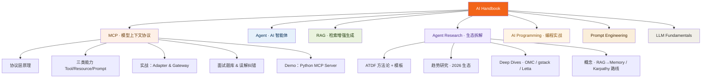
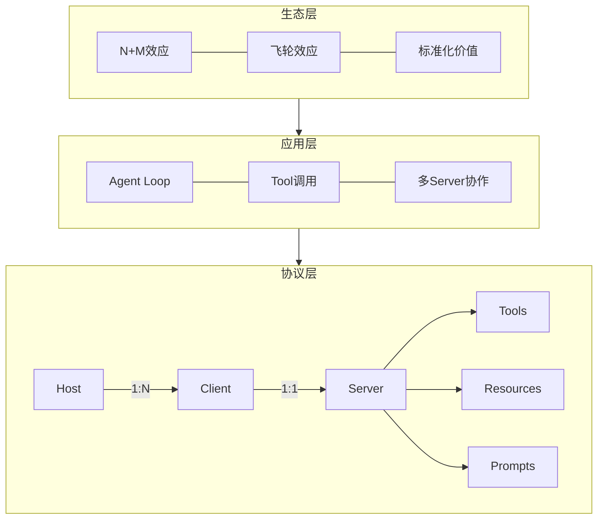
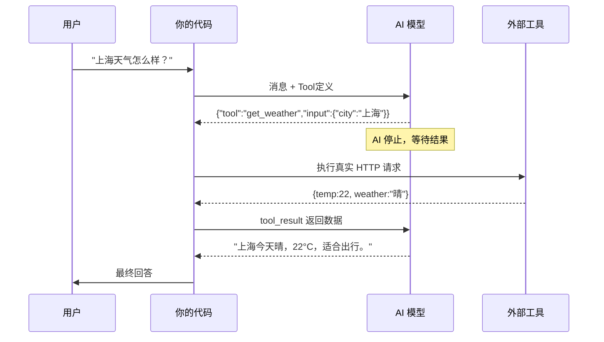

# AI Handbook · AI 工程师知识手册

让知识以地图的形式呈现在你的脑中

> AI 应用工程师的完整学习记录。
> 不只是文档整理——包含 **深度追问过程**、**真实误解纠错**、和**可在浏览器直接打开的交互式笔记**。

**[🌐 在线交互版](https://bob798.github.io/ai-handbook/)** · **[AI 开发日记](https://bob798.github.io)**

---

## 为什么有这个仓库

学 AI 技术，最难的不是"找到资料"，而是"真正理解"。

这个仓库记录的不是整理好的知识点，而是**从困惑到清晰的完整过程**：包括我理解错的地方、追问了多少轮、以及最终怎么建立起体系化认知的。

如果你也在学同样的内容，这里的误解记录可能比标准答案更有价值。

---

## 内容地图



---

## MCP · 目前最完整的部分

### MCP 架构三层模型



### Function Calling 完整循环



> **关键认知**：AI 永远不直接执行任何操作。AI 只输出意图（JSON），你的代码负责执行。这个边界是整个 Agent 架构安全模型的基石。

### N×M → N+M：MCP 的核心价值

```mermaid
graph LR
    subgraph 没有MCP · 200次集成工作
        direction TB
        App1 --> Slack1[Slack]
        App1 --> GitHub1[GitHub]
        App1 --> DB1[Database]
        App2 --> Slack2[Slack]
        App2 --> GitHub2[GitHub]
        App2 --> DB2[Database]
    end

    subgraph 有MCP · 30次集成工作
        direction TB
        AppA --> MCP[MCP 标准层]
        AppB --> MCP
        MCP --> SlackS[Slack Server]
        MCP --> GitHubS[GitHub Server]
        MCP --> DBS[DB Server]
    end
```

> N 个 App × M 个系统 = N×M 次重复开发 → 引入 MCP 标准层后变为 N+M 次

### MCP 与 REST/gRPC 的本质区别

```mermaid
graph TD
    subgraph REST_API[REST API · 为人类开发者设计]
        R1[POST /v1/txn/proc] --> R2[语义在文档里]
        R2 --> R3[开发者读文档再调用]
    end

    subgraph MCP_Tool[MCP Tool · 为 AI 模型设计]
        M1["description: 当用户需要...时使用<br/>何时不用: 已知ID时用get_customer<br/>副作用: 只读，不修改数据"] --> M2[语义嵌入接口定义本身]
        M2 --> M3[AI 自主推理决定是否调用]
    end

    REST_API --"Semantically Opaque<br/>语义不透明"--> ❌
    MCP_Tool --"Self-describing<br/>自描述"--> ✅
```

---

## 文件导航

### Agent Research · 生态拆解（NEW）

| 文件 | 内容 | 适合 |
|---|---|---|
| [ATDF 方法论](agent-research/methodology/ATDF.md) | 8 维度拆解框架 + 模板 | 想系统学习任何 AI 主题 |
| [Agent 生态 2026](agent-research/research/agent-ecosystem-2026.md) | 协议战争 · 领域改造 · 创新空白 | 了解 Agent 全局 |
| [OMC 拆解](agent-research/deep-dives/omc/omc-atdf.md) | 多 Agent 编排框架深度拆解 | 学 Agent 系统设计 |
| [gstack 拆解](agent-research/deep-dives/gstack/gstack-atdf.md) | AI 编程方法论深度拆解 | 学角色 prompt 设计 |
| [从 RAG 到 Memory](agent-research/concepts/rag-to-memory.md) | RAG 演化路线 + 商业分层 | 判断技术投入方向 |
| [Karpathy 路线](agent-research/concepts/karpathy-route.md) | LLM OS → LLM Wiki → Software 3.0 | 理解 Memory 思想源头 |

### MCP 完整路径

| 文件 | 内容 | 适合 |
|---|---|---|
| [01-foundations](mcp/01-foundations/README.md) | MCP是什么、N+M逻辑、生态意义 | 入门 |
| [tools-resources-prompts](mcp/02-core-concepts/tools-resources-prompts.md) | 三类能力详解 + Schema + 大数据场景 | 核心概念 |
| [function-calling](mcp/02-core-concepts/function-calling.md) | FC前世今生 + 完整循环代码示例 | 底层原理 |
| [adapter-gateway](mcp/03-practical/adapter-gateway.md) | 异构系统接入 + Gateway设计 | 实战架构 |
| [面试题库](mcp/05-interview/qa.md) | 基础+进阶+实战，含一句话版本 | 面试备战 |
| [理解错的10件事](mcp/05-interview/common-misconceptions.md) | 真实误解记录，SEO价值高 | 查漏补缺 |

### 交互式笔记（下载后浏览器直接打开）

| 文件 | 内容 |
|---|---|
| [mcp_11q.html](mcp/interactive/mcp_11q.html) | 11个深度追问：Prompt模板/Gateway/FC机制/语义透明 |
| [mcp_5q.html](mcp/interactive/mcp_5q.html) | 5个机制追问：AI停止后谁触发/Schema含义/动态注册 |
| [knowledge_methodology.html](mcp/interactive/knowledge_methodology.html) | 5D知识习得方法论（可迁移到任意领域） |

### 可运行代码

| 文件 | 说明 |
|---|---|
| [hello-server-mcp.py](mcp/demo/hello-server-mcp.py) | 最简 MCP Server，理解基本结构 |
| [file-server-mcp.py](mcp/demo/file-server-mcp.py) | 实战：搜索本地 Markdown 笔记 |

---

## 快速上手 MCP Demo

```bash
# 1. 克隆仓库
git clone https://github.com/bob798/ai-handbook.git
cd ai-handbook/mcp/demo

# 2. 创建虚拟环境（需要 Python 3.10+）
python3 -m venv .venv
source .venv/bin/activate

# 3. 安装依赖
pip install -r requirements.txt

# 4. 运行最简示例
python hello-server-mcp.py

# 5. 运行笔记搜索 Server
NOTES_PATH=/your/notes/path python file-server-mcp.py
```

Claude Desktop 配置见 [demo/README.md](mcp/demo/README.md)。

---

## 博客自动同步

本仓库内容自动同步到 [Bob's Digital Garden](https://bob798.github.io/ai-handbook/)。

- push 到 main/master 后，GitHub Actions 通过 `repository_dispatch` 触发博客重建
- Markdown → Quartz 渲染，HTML 交互笔记 → 静态页面直接访问
- 配置：repo secret `BLOG_DISPATCH_TOKEN`（指向 bob798-blog 的 Fine-grained PAT）

## 关于作者

AI 应用工程师，做 [AI 开发日记](https://bob798.github.io) 系列内容。

这个仓库是我边学边记的过程，不是整理好的教程。如果你发现错误或者有更好的理解，欢迎开 Issue。

如果内容对你有帮助，欢迎 ⭐ **Star**。

---

## License

MIT
