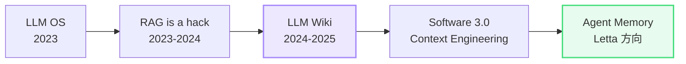

# Karpathy 路线：从 RAG 到 LLM Wiki

> 整理 Andrej Karpathy 在不同时间点关于 Agent Memory / Knowledge 的核心主张

## 不是一个产品，是一组收敛的思想

## 五个关键主张

### 1. LLM OS（2023）
LLM 是新操作系统内核，context window = RAM，知识库 = 磁盘，工具 = 外设。

这个类比暗示：传统 RAG 只是一种"临时补丁"，就像操作系统出现之前用户手动管理内存。

### 2. "RAG is a hack"（多次提到）
核心论点：人类不是靠"在图书馆搜相似段落"来记住知识的。

当前的 RAG（把文档切碎塞进 embedding，用户提问时检索相关片段拼进 prompt）不是知识的组织方式——它只是搜索引擎的变体。

### 3. LLM Wiki（2024-2025）
最具体的一个设想：**模型自己读写一个 wiki 风格的知识库**。

- 模型不仅查，还要**编辑、去重、归纳、交叉引用**
- 像人类维护 Notion / Obsidian 一样
- 知识是**被持续整理的活体制品**，不是一次性灌进去的死数据

### 4. Software 3.0 / Context Engineering
Prompt + Context 本身就是编程。

- Software 1.0 = 人写代码
- Software 2.0 = 人标数据，模型学
- **Software 3.0 = 人管上下文，模型执行**

核心技能从"写算法"变成"管理上下文"——这直接催生了 **Context Engineering** 作为一个新学科。

### 5. Agent Memory
Karpathy 明确认为 Letta / MemGPT 这类方向比朴素 RAG 更接近"正确答案"，但也指出目前所有 Memory 系统都还很粗糙。

## 谁在实现这条路线

| 公司 / 项目 | 对应哪一步 | 具体做了什么 |
|---|---|---|
| **Anthropic** | Skills / Artifacts / Projects | 用户可管理的结构化知识制品 |
| **OpenAI** | Memory / Custom GPTs | 跨会话记忆 + 个性化 |
| **Letta (MemGPT)** | 全栈 Agent Memory | tiered memory + sleep-time compute |
| **Mem0** | Memory 抽象层 | 轻量级记忆 API |
| **LangGraph** | State + Checkpointing | 工作流状态持久化 |

## 延伸阅读

- [从 RAG 到 Memory 演化](rag-to-memory.md) — 商业价值分层 + 各方向判断
- [MemGPT/Letta 入门指南](../deep-dives/memgpt-letta/memgpt-letta-guide.html) — 用秘书比喻理解三级记忆
