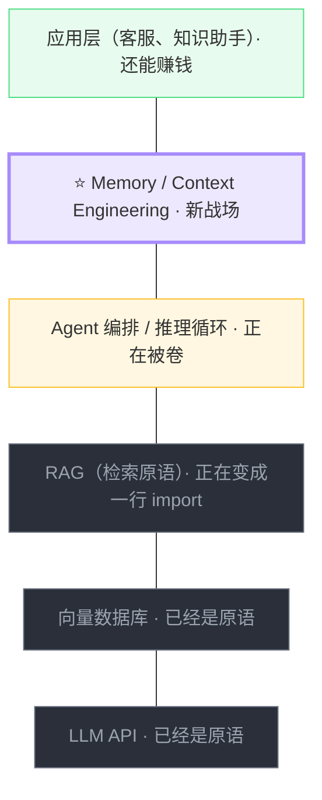

# 从 RAG 到 Agent Memory：演化路线

> 提炼自 [Agent 生态趋势研究](../research/agent-ecosystem-2026.md) 第八章

## 传统 RAG 会被淘汰吗

会，但不是被"更好的 RAG"替代——而是**被降级为基础设施原语**。

**根本缺陷**：chunk + embed + topK 本质是"语义搜索 + 字符串拼接"。切块破坏语义、embedding 相似度 ≠ 相关性、检索无状态无推理、知识更新困难。本质是一个被 LLM 美化的搜索引擎。

## "基础设施原语"是什么意思

原语（Primitive）= 最基础、被其他东西依赖的构建块。历史上很多"曾经的产品"都变成了"现在的原语"：

| 曾经是产品 | 现在是原语 |
|---|---|
| B-tree | 数据库里的一个模块 |
| TCP/IP | 操作系统一行 import |
| JSON 解析 | 语言内置 |
| OAuth | 标准库 |

这些东西没有消失——它们比任何时候都用得更多，但从"产品"降级成了"原语"。

RAG 正在经历同样的过程：
- **今天**：有公司专门卖 RAG 方案、有 RAG 工程师职位
- **2-3 年后**：Postgres 的一个扩展（pgvector）、LangChain 的一行函数、Claude API 的一个参数

## 商业价值的分层



## 演化方向

```
传统 RAG（切块 + embedding + topK）
         ↓
知识应该像 wiki 一样被 Agent 主动维护
         ↓
Memory / Context 本身就是一等公民
         ↓
工程师的新核心能力 = Context Engineering
```

## 各方向判断

| 方向 | 判断 |
|---|---|
| 基础模型训练 | ❌ 资本密集 |
| Agent 编排框架 | ❌ 红海 |
| 通用 Agent 产品 | ❌ 大厂肌肉战 |
| RAG 本身 | ❌ 正被降级为原语 |
| 评估 / 观测 | 🟡 好方向但天花板低 |
| 垂直行业 Agent | 🟡 好但需行业资源 |
| **Memory / Context Engineering** | ✅ 趋势明确 + 拥挤度低 + 纯工程战场 |

## 延伸阅读

- [Karpathy 路线](karpathy-route.md) — LLM OS / LLM Wiki / Software 3.0
- [MemGPT/Letta 入门指南](../deep-dives/memgpt-letta/memgpt-letta-guide.html) — 用秘书比喻理解 Agent Memory
