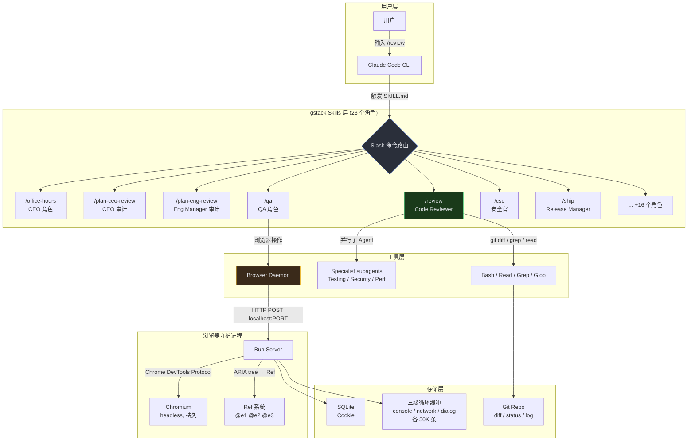
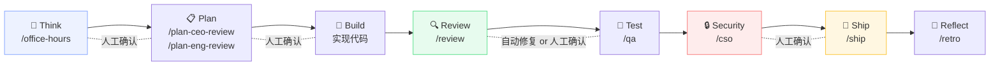
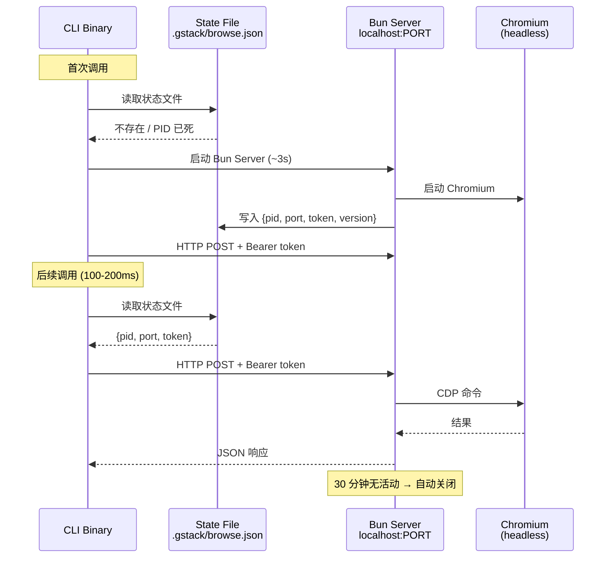
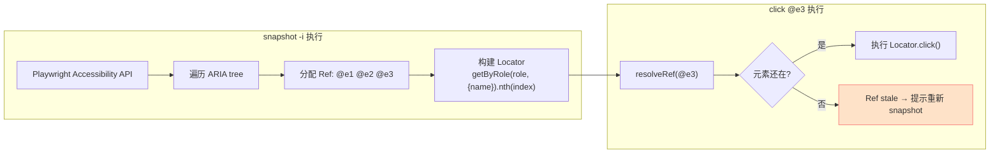
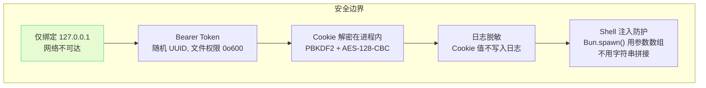
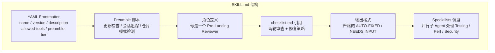
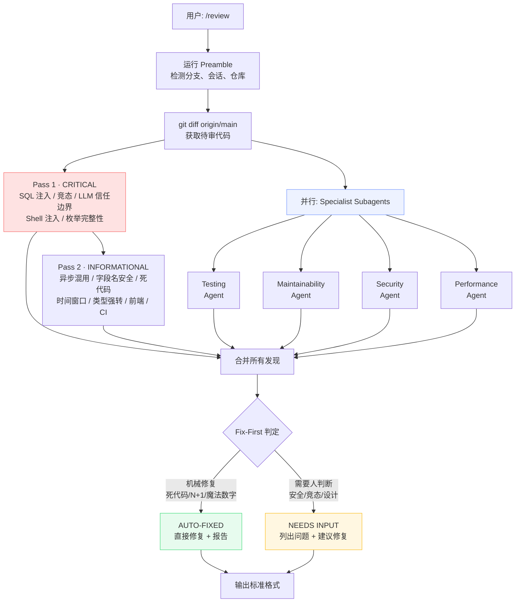
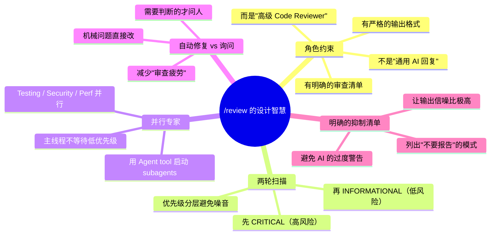
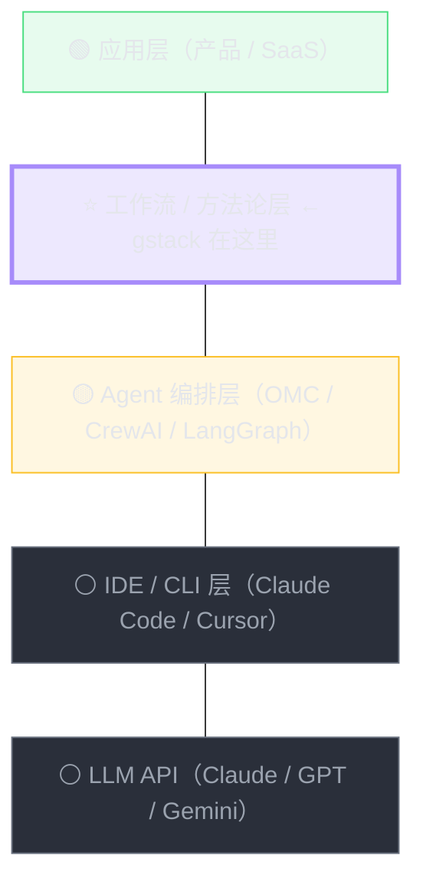
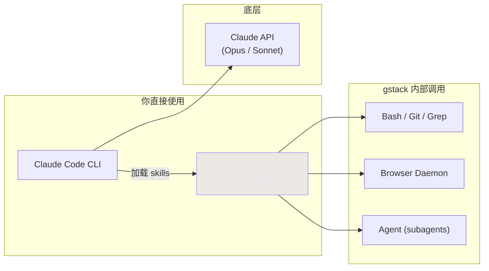

# gstack · ATDF Deep Dive
> 日期: 2026-04-12 · 深度: Deep · 耗时: ~1.5h · 来源: github.com/garrytan/gstack

## 📖 术语速查

> 正文中反复出现的英文术语，先扫一遍再往下读。

| 术语 | 直译 | 在 gstack 里的含义 | 生活化比喻 |
|---|---|---|---|
| **Preamble** | 前言 / 序言 | 每个 skill 触发时**最先运行的一段脚本**，用于检测环境（分支、会话、仓库类型）并注入上下文。类似"上班前先打卡、看看今天日程"。 | 厨师做菜前先检查食材、预热烤箱 |
| **Fix-First** | 修复优先 | 一种审查策略：**能自动修的先修掉，需要人判断的才问人**。不是"先列出所有问题等人确认"，而是"能改就改、改完再汇报"。 | 保洁阿姨打扫时，垃圾直接倒掉不问你，但发现贵重物品会先问你要不要扔 |
| **Specialist** | 专家 / 专员 | 被主 Agent 通过 `Agent` tool 启动的**并行子 Agent**，各负责一个细分领域（测试覆盖、安全、性能、可维护性）。做完后把结论返回给主 Agent 合并。 | 主任医师出诊时，同时叫来放射科、检验科各做各的检查，最后主任汇总诊断 |
| **CRITICAL** | 关键 / 严重 | 审查的**第一优先级**——SQL 注入、竞态条件、LLM 信任边界、Shell 注入。这些问题不修就可能生产事故。 | 体检里的"红色警告"——必须立刻处理 |
| **INFORMATIONAL** | 提示性 / 告知性 | 审查的**第二优先级**——异步混用、死代码、格式问题。不修不会崩，但影响代码质量和可维护性。 | 体检里的"黄色提醒"——建议关注 |
| **AUTO-FIXED** | 已自动修复 | 审查发现的问题中，**Agent 自己就改了**的那些（机械性修复：死代码删除、魔法数字替换等）。报告里列出"改了什么"让你知道。 | 保洁阿姨的清扫报告："厨房垃圾已倒、桌面已擦" |

> **阅读建议**：遇到其他不懂的英文，在正文旁标注 `<!-- ? -->` 后告诉我，我追加到这张表里。

---

## ① 定位

- **一句话**: YC 总裁 Garry Tan 开源的 Claude Code 技能包——用 23 个 AI 角色（CEO / 工程经理 / 设计师 / QA / 安全官）把一个 AI 编程助手变成一支虚拟软件团队。
- **类别**: AI 编程工作流框架（Skills Layer on top of Claude Code）
- **替代了 / 增强了**: 增强 Claude Code。替代了手动写 prompt 控制编码质量的"纯聊天式编程"。
- **无它时怎么做**: 直接和 Claude Code 对话写代码，没有角色分工、没有强制 review 阶段、没有结构化 checkpoint。靠个人纪律保证质量。

**核心主张**: "方法论比能力更重要"——不追求更聪明的单体 Agent，而是用角色约束 + 流程 checkpoint 让 AI 交付生产级代码。

---

## ② 架构

### 系统总览



### 工作流阶段（流程门控）



### 浏览器守护进程架构



### Ref 系统工作原理



### 安全模型



### 关键机制总结
1. **角色隔离**: 每个 slash 命令 = 一个"虚拟团队成员"，各有专属 SKILL.md (system prompt)
2. **阶段门控**: Think → Plan → Build → Review → Test → Ship → Reflect，每阶段有人工确认点
3. **守护进程**: 首次 ~3s 启动，后续 100-200ms 复用持久 Chromium
4. **Ref 系统**: 基于 ARIA 无障碍树（非 CSS 选择器），兼容 CSP / React / Shadow DOM
5. **SKILL.md 自动生成**: `.tmpl` 模板 + 源码元数据 → CI 验证，防止文档与代码漂移

### 依赖
- Claude Code CLI（必须）
- Bun runtime（编译时，产物 ~58MB 无需 node_modules）
- Playwright + Chromium（浏览器自动化）
- SQLite（Cookie 管理）

### 稳定 vs 演化
- **稳定**: 角色模型 + 阶段流程 = 核心设计哲学，不太会变
- **演化中**: 具体 slash 命令数量和提示词会频繁调整；浏览器自动化层可能被更好的方案替代

---

## ②+ 具体 Skill 拆解：`/review`（Pre-Landing Code Review）

> 以 `/review` 为例，展示 gstack 一个 skill 从文件结构到执行流程的完整机制。

### 文件结构

```
review/
├── SKILL.md            ← Claude Code 加载的角色说明（自动生成）
├── SKILL.md.tmpl       ← 人工维护的模板源
├── checklist.md        ← 审查清单（两轮 + 专家分支）
├── design-checklist.md ← 设计审查清单
├── TODOS-format.md     ← TODO 输出格式
├── greptile-triage.md  ← 外部工具集成
└── specialists/        ← 并行子 Agent 专家定义
    ├── testing.md
    ├── maintainability.md
    ├── security.md
    └── performance.md
```

### SKILL.md 的结构（核心）



### YAML Frontmatter（元数据）

```yaml
name: review
preamble-tier: 4
version: 1.0.0
description: |
  Pre-landing PR review. Analyzes diff against the base branch for SQL safety,
  LLM trust boundary violations, conditional side effects, and other structural issues.
  Use when asked to "review this PR", "code review", "pre-landing review".
  Proactively suggest when the user is about to merge or land code changes.
allowed-tools:
  - Bash
  - Read
  - Edit
  - Write
  - Grep
  - Glob
  - Agent          # ← 用于启动 specialist subagents
  - AskUserQuestion
  - WebSearch
```

**关键设计**：
- `preamble-tier: 4` — 控制 preamble 脚本的加载级别
- `allowed-tools` — 白名单机制，限制该角色能调用的工具
- `description` 里包含触发词（"review this PR"、"code review"）— Claude Code 用这个做 skill 匹配

### Preamble 脚本（每个 skill 的启动仪式）

```bash
# 简化版 — 每次 /review 触发时先跑这段
_UPD=$(gstack-update-check 2>/dev/null || true)    # 检查 gstack 版本
mkdir -p ~/.gstack/sessions
touch ~/.gstack/sessions/"$PPID"                     # 记录会话
_SESSIONS=$(find ~/.gstack/sessions -mmin -120 | wc -l)  # 统计活跃会话
_BRANCH=$(git branch --show-current)                 # 获取当前分支
REPO_MODE=$(gstack-repo-mode)                        # 检测仓库类型
```

**为什么要这个？** 给每个 skill 注入环境上下文——分支、会话数、仓库模式等——让角色的回复更精准。

### 审查流程（两轮 + 专家分支）



### Fix-First 判定规则

| 自动修复 (AUTO-FIX) | 需要人判断 (ASK) |
|---|---|
| 死代码 / 未使用变量 | 安全问题（auth / XSS / 注入）|
| N+1 查询（补 eager loading）| 竞态条件 |
| 过期注释 | 设计决策 |
| 魔法数字 → 命名常量 | 大改（>20 行）|
| 缺失 LLM 输出校验 | 删除功能 |
| 版本 / 路径不匹配 | 影响用户可见行为 |

**判断法则**：资深工程师会直接改不讨论 → AUTO-FIX；合理的工程师可能会意见不同 → ASK。

### 输出格式（严格约束）

```
Pre-Landing Review: 5 issues (2 critical, 3 informational)

**AUTO-FIXED:**
- [src/auth.ts:42] Missing LLM output validation → added EMAIL_REGEXP guard
- [lib/cache.ts:88] Magic number 86400 → SECONDS_PER_DAY constant

**NEEDS INPUT:**
- [api/orders.ts:123] Race condition in status transition
  Recommended fix: atomic WHERE old_status = ? UPDATE SET new_status
- [db/migrate.ts:67] N+1 in user loop — adding .includes(:orders)
  Recommended fix: add eager loading
```

**没有问题时**：`Pre-Landing Review: No issues found.`

### 这个设计教会我们什么



### 你可以学到并复用的模式

| 模式 | gstack `/review` 怎么做 | 你可以怎么用 |
|---|---|---|
| **角色 prompt 结构** | YAML frontmatter + preamble + 角色定义 + checklist + 输出格式 | 给你的 RAG 审计工具写 SKILL.md |
| **两轮扫描** | Critical → Informational 分层 | RAG 审计也可以分"知识过期" vs "格式问题" |
| **Fix-First 判定** | 机械 → 自动修复，需判断 → 问人 | 知识库审计也可以自动标过期 + 人工确认删除 |
| **并行 subagent** | Agent tool 启动 specialist | 同时检查多种知识质量维度 |
| **抑制清单** | 明确列出不报告的东西 | 避免审计工具报太多假阳性 |
| **严格输出格式** | 模板化 `AUTO-FIXED / NEEDS INPUT` | 让审计报告一眼能看 |

---

## ③ 产品

- **用户**: 独立开发者、创业者、想用 AI 提升个人产能的工程师。也支持团队共享配置。
- **分发**: 纯开源 MIT，`git clone` 到 `~/.claude/skills/gstack` + `./setup`
- **定价**: 免费。唯一成本是 Claude Code 的 API 调用费用（内置 E2E 测试约 $3.85/次，LLM 评判约 $0.15/次）
- **支持平台**: Claude Code（原生）+ OpenAI Codex CLI + OpenCode + Cursor + Factory Droid + Slate + Kiro（6+ 平台）
- **上手难度**: ⭐⭐/5 — 前提是已有 Claude Code 环境，安装 30 秒

### GitHub 数据（2026-04-12）
- Stars: **~70,000**
- Forks: **~9,800**
- 语言: TypeScript
- 创建: 2026-03-11（仅 1 个月）
- Open Issues: 342
- 第一周即破 23K stars

---

## ④ 业务

### 竞品对比

| 竞品 | 差异化 | gstack 优势 |
|---|---|---|
| **oh-my-claudecode** | Agent 编排 + HUD + hooks 全家桶 | gstack 更聚焦"角色方法论"，更轻量 |
| **Cursor Rules / .cursorrules** | IDE 级 prompt 定制 | gstack 提供完整工作流（不只是单次 prompt） |
| **Devin / SWE-agent** | 全自动端到端 AI 编程 | gstack 保留人类在关键节点的决策权 |
| **CrewAI / AutoGen** | 通用多 Agent 框架 | gstack 是开箱即用的"预置角色"，不是框架 |
| **superpowers** | Claude Code skill 集合 | gstack 来自 YC 总裁的实战验证，明星效应 |

### 护城河
- **Garry Tan 个人品牌**: YC 总裁 + 60 天 60 万行代码的叙事 = 巨大信任锚
- **实战验证**: 不是理论框架，是从真实产品里抽取的方法论
- **社区飞轮**: 70K stars 带来持续贡献和二次创作
- **缺陷**: 护城河主要是人+叙事，技术层面任何人都可以复刻

### 5 年生存预测
gstack **作为独立项目**可能不会存活 5 年——更可能被 Claude Code 原生吸收（Anthropic 已经在做 `/team`、Skills 生态），或演化成一个更大平台的一部分。但它代表的**"角色约束 + 流程门控"方法论**会成为 AI 编程的标准范式之一。

---

## ⑤ 使用

### 30 秒 Quickstart
```bash
git clone --single-branch --depth 1 \
  https://github.com/garrytan/gstack.git \
  ~/.claude/skills/gstack
cd ~/.claude/skills/gstack && ./setup
```

### 典型工作流（18 个 slash 命令中的核心 7 个）
```
/office-hours        → 战略讨论、需求澄清（CEO 角色）
/plan-ceo-review     → CEO 视角审计计划
/plan-eng-review     → 工程经理视角审计计划
(实现代码)
/review              → 代码审查（Eng Manager 角色）
/qa                  → 质量检测（QA 角色）
/cso                 → 安全审计（CSO 角色）
/ship                → 部署（Release Manager 角色）
```

### 3 个坑
1. **需要 Claude Code 订阅或 API key**——gstack 本身免费，但 Claude Code 要钱。新手容易忽略这个前提
2. **角色太多容易迷路**——23 个命令记不住，建议先只用核心 7 个（上面列的）
3. **Chromium 占资源**——浏览器自动化层会常驻 Chromium 进程，小内存机器会卡

### 用 / 不用场景

| 适合 | 不适合 |
|---|---|
| 独立开发者要保证代码质量 | 大团队已有 CI/CD + Code Review |
| 快速原型 → 生产级的转化 | 纯研究/实验性代码 |
| 创业者一人做全栈 | 只需要简单问答（直接用 Claude 就行） |
| 想学 AI 编程方法论的人 | 不用 Claude Code 的人 |

### 我的工作接触点
- 当前做企业 RAG 客服——gstack 的 `/qa` 和 `/review` 角色可以直接用于 RAG 系统的代码质量保证
- 如果开始做 OSS 项目（RAG Freshness Auditor 等），gstack 的 `/plan-ceo-review` + `/plan-eng-review` 双重审计能帮助一个人拿出团队级的计划
- 学习参考：gstack 的 SKILL.md 写法是学"如何给 AI 写好角色 prompt"的优秀教材

### 预计学习曲线
- 安装 + 核心 7 命令：**1 小时**
- 全 23 命令熟练：**1 周**
- 理解架构并定制自己的角色：**2 周**

---

## ⑥ 生态位 ⭐

### 在商业价值分层图中的位置



更直观的定位图：



gstack 处于**"工作流 / 方法论层"**——不是底层能力也不是最终产品，而是"用已有 AI 能力更好地工作"的流程框架。

### 平台吞噬风险
**高。** Anthropic 已经在做 Claude Code 原生 Skills 和 `/team`。如果 Anthropic 把"角色模板 + 阶段门控"做成一等公民功能，gstack 的技术层会被吞噬。但它的**方法论**（Think-Plan-Build-Review-Test-Ship-Reflect）不会消失——会变成行业共识。

### 对个人工程师的机会判断

| 角度 | 判断 |
|---|---|
| 学习价值 | ✅ **非常高** — 23 个 SKILL.md 是学"AI 编程方法论"的最佳教材 |
| 使用价值 | ✅ **高** — 即使不用全套，cherry-pick 几个角色就很有用 |
| 贡献价值 | 🟡 **中** — 70K stars 项目里刷贡献对简历有帮助，但竞争激烈 |
| 创业价值 | ❌ **低** — 这个赛道的壁垒在人和叙事，不在技术 |
| 仿写价值 | ✅ **最高** — 学习它的 SKILL.md 写法，给自己的工作场景写类似角色 |

### 3 年演化预测
- **1 年内**: gstack 继续迭代，可能被 Anthropic 官方收编或合作，Garry Tan 继续用它证明 AI 编程的上限
- **2 年后**: "角色 + 流程"模式成为 AI IDE 标配（就像 Git hooks 之于 CI），gstack 的具体实现被平台化吸收
- **3 年后**: gstack 本体可能不再独立维护，但"Think-Plan-Build-Review-Test-Ship-Reflect"会成为 AI 编程的事实标准流程——类比 Git Flow 之于版本控制

### 值不值得投入

**值得投入时间学习和使用，不值得投入职业路径去做"另一个 gstack"。**

具体建议：
- ✅ 花 2 小时装上来体验，理解它的角色设计哲学
- ✅ 精读 3-5 个 SKILL.md，学习"如何给 AI 写好角色 prompt"
- ✅ Cherry-pick `/review` + `/qa` 到你自己的工作流里
- ✅ 参考它的架构给自己的 OSS 项目写角色（如"RAG 审计员"角色）
- ❌ 不要试图做"另一个 gstack"——这条赛道的壁垒是 Garry Tan 本人

---

## 🎯 一句话结论（3 个月后再看）

**gstack 是 2026 年"AI 编程方法论"的最佳范本——它证明了"角色约束 + 流程门控"比"更聪明的单体 Agent"更实用。学它的思想而不是用它的代码，把 SKILL.md 写法迁移到你自己的 Agent Memory 项目里，这才是最大的收获。**
