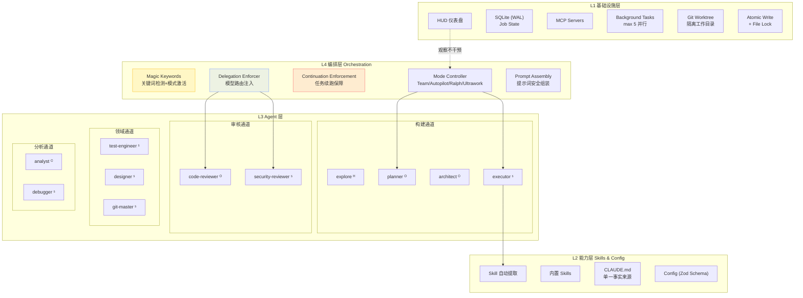
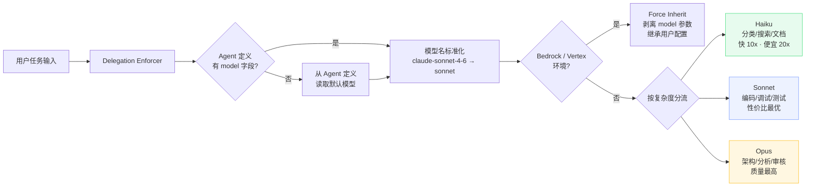
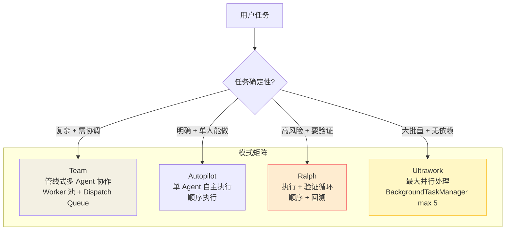
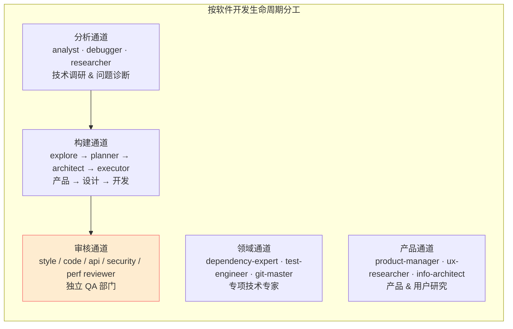
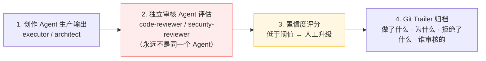
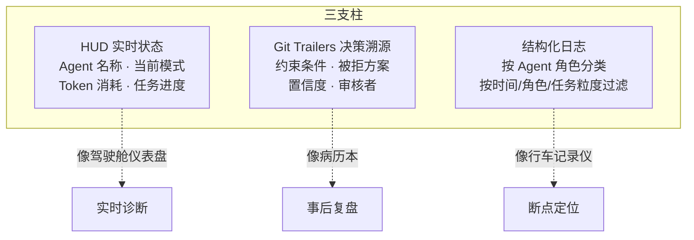
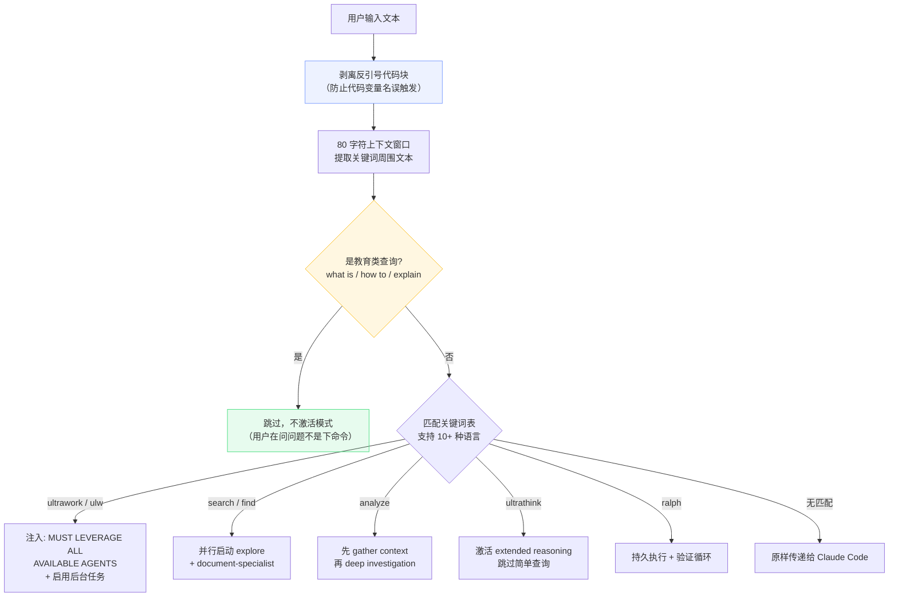
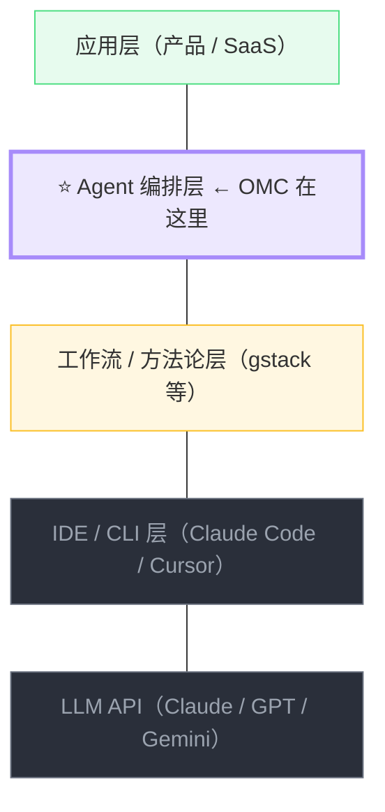
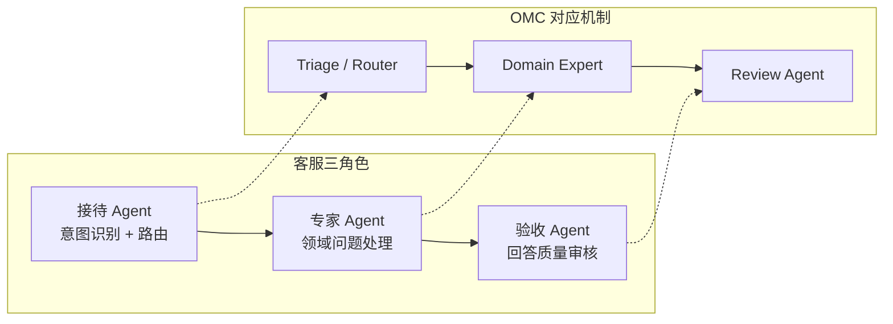

# oh-my-claudecode (OMC) · ATDF Deep Dive
> 日期: 2026-04-12 · 深度: Deep · 耗时: ~3h · 来源: github.com/Yeachan-Heo/oh-my-claudecode
> 整合自: omc-analysis.html (案例分析) + omc-engineering.html (工程架构拆解)

## 📖 术语速查

| 术语 | 直译 | 在 OMC 中的含义 | 生活化比喻 |
|---|---|---|---|
| **Orchestration** | 编排 | 协调多个 Agent 的分工、调度、执行顺序的核心逻辑层 | 交响乐指挥——不演奏任何乐器，但决定谁何时演奏什么 |
| **Delegation Enforcer** | 委派执行器 | 拦截所有 Agent 调用，自动注入正确的模型参数（Haiku/Sonnet/Opus） | 人事部给每个新员工自动分配工位、门禁卡、电脑 |
| **Magic Keywords** | 魔法关键词 | 用户输入中的触发词（如 "ulw"、"ralph"），自动激活对应执行模式 | 快递柜上的取件码——输入特定词就触发特定流程 |
| **Continuation Enforcement** | 任务续跑 | 防止 Agent 在任务未完成时自行停止的保障机制 | 流水线上的"未完工挡板"——产品没做完不允许下线 |
| **Preamble** | 前言脚本 | 每个 skill/hook 触发时最先执行的环境检测脚本 | 上班打卡 + 检查今天日程 |
| **HUD** | 平视显示器 | 实时显示 Agent 状态、Token 消耗、任务进度的仪表盘 | 汽车仪表盘——不开车也能看速度、油量、发动机状态 |
| **Git Trailers** | Git 尾部标记 | 附在 commit message 尾部的结构化元数据（约束、拒绝方案、置信度） | 病历本——不只记录开了什么药，还记录为什么排除其他方案 |
| **Worktree** | 工作树 | Git 的独立工作目录，让多个 Agent 在不同分支并行工作互不干扰 | 多个厨师各用一个独立灶台，做完再把菜端到一桌 |
| **Rate Limit** | 速率限制 | API 调用频率上限，超出后被暂时阻塞 | 高速公路限流——车太多时入口亮红灯排队 |
| **Human-in-the-Loop** | 人在回路中 | AI 不确定时强制人工介入的设计——不是"AI 做不了才找人"，而是"AI 不确定的必须找人" | 自动驾驶遇到未知路况 → 把方向盘交还司机 |

---

## ① 定位

- **一句话**: Claude Code 的多 Agent 编排框架——用 19+ 个专精 Agent、4 种执行模式、智能模型路由，把一个 AI 编程助手变成一个有流程纪律的虚拟软件团队。
- **类别**: AI Agent 编排层 / Claude Code 增强框架
- **替代了 / 增强了**: 增强 Claude Code CLI。替代了"单一 AI 对话式编程"的无结构工作方式。
- **无它时怎么做**: 直接和 Claude Code 对话，手动管理 Agent 分工、手动选模型、手动审查质量、无实时可观测性。

**核心论点**: OMC 证明了一个关键洞察——**Agent 系统本质是软件架构问题，不是 AI 问题**。模型能力是基座，但系统能力来自编排、分工和工程纪律。19 个专精 Agent 协作的效果，远超 1 个通用 Agent 的独白。

**D3 类比（电影剧组）**:
- 导演（Planner Agent）→ 拆任务、分角色、把控节奏
- 摄影/灯光/美术（Domain Agents）→ 各司其职
- 剪辑师（Review Agents）→ 独立审核，创作者不能自己剪片
- 场记（HUD + Git Trailers）→ 记录每个决策，下一场能接上

---

## ② 架构

### 四层系统总览



> ᴴ = Haiku（快且便宜）· ˢ = Sonnet（性价比最优）· ᴼ = Opus（贵但值得）

### 模型路由策略



**D3 类比（医院分诊）**: Haiku = 护士挂号分诊（3 秒）· Sonnet = 全科医生处理 80% 常规病例 · Opus = 专科主任只接疑难杂症。**不是所有病人都需要找主任，过度使用 Opus 不会提升质量，只会增加等待和费用。**

### 四种执行模式



| 模式 | 触发词 | 策略 | 团队类比 | 适用场景 |
|---|---|---|---|---|
| **Team** | `team` | 管线式多 Agent | 结对编程 | 复杂功能，需实时协调 |
| **Autopilot** | `autopilot` | 单 Agent 自主 | 独立冲刺 + 定期 Standup | 需求明确，验收标准清晰 |
| **Ralph** | `ralph` | 执行 + 验证循环 | 导师带教 + Tech Lead Review | 高风险变更 |
| **Ultrawork** | `ulw` | 最大并行 | 多个独立小队 | 大批量无依赖任务 |

### 五大 Agent 通道



**关键设计原则**:
- **关注点分离**: 创作 Agent 和审核 Agent **永远不是同一个角色**——防止"自己审自己"的确认偏误
- **策略模式**: 4 种执行模式是可互换的编排策略，取决于**任务确定性**而非任务类型
- **插件架构**: Skill 系统是运行时可扩展的能力注入，不改核心代码
- **观察者模式**: HUD 是被动监控，拔掉 HUD 系统照常运转——可观测性不引入耦合

### 质量控制流水线



### 可观测性三支柱



### 源码目录结构

```
src/ (~200 文件)
├── index.ts (11.7KB)           ← 主入口 createOmcSession()
├── agents/                     ← Agent 系统 (20+ 角色)
│   ├── definitions.ts (16.2KB)   所有 Agent 配置
│   ├── prompt-helpers.ts (8.6KB) 提示词安全组装
│   └── prompt-sections/          模块化提示词片段
├── features/                   ← 核心机制模块
│   ├── magic-keywords.ts (18.5KB)         关键词检测
│   ├── delegation-enforcer.ts (10.1KB)    模型路由
│   ├── continuation-enforcement.ts (7.1KB) 任务续跑
│   ├── background-tasks.ts (10.7KB)       后台任务 max 5
│   └── auto-update.ts (37.9KB)            版本管理 (最大文件)
├── hud/                        ← 仪表盘 (最复杂子系统)
│   ├── index.ts (19.3KB)        状态聚合
│   ├── types.ts (26.4KB)        30+ 可配置元素
│   ├── usage-api.ts (29.7KB)    Rate limit 双路径上报
│   └── transcript.ts (24.4KB)   Session 解析
├── team/                       ← Team 模式 (20+ 文件)
│   ├── dispatch-queue.ts         任务分发队列
│   ├── inbox-outbox.ts           异步消息
│   ├── worker-health.ts          健康监控 + 心跳
│   └── git-worktree.ts           隔离工作目录
├── mcp/                        ← MCP 协议层
│   ├── job-management.ts (27KB)  核心复杂度 (最大单文件)
│   └── prompt-injection.ts       注入防护
├── lib/                        ← 基础库
│   ├── job-state-db.ts (23.5KB)  SQLite 持久化
│   ├── atomic-write.ts           安全写入
│   └── file-lock.ts              并发锁
└── bridge/                     ← 编译产物
    ├── cli.cjs (3MB)             主 CLI
    ├── mcp-server.cjs (888KB)    MCP 服务器
    └── gyoshu_bridge.py (32KB)   Python 桥接
```

### 依赖
- Claude Code CLI（必须）
- TypeScript + Bun（编译时）
- SQLite WAL 模式（Job State DB）
- Git（worktree 隔离）

### 稳定 vs 演化
- **稳定**: 四层架构 + 五大通道 + 创作/审核分离 = 核心设计原则
- **演化中**: 具体 Agent 数量/提示词/模型路由规则 · Team 模式 runtime v2 正在重写 · HUD 配置选项持续膨胀

---

## ②+ 具体机制拆解：Magic Keywords（魔法关键词系统）

> 选 Magic Keywords 作为深入对象——它是用户与编排层的"入口"，最能体现 OMC 的设计哲学。

### 文件
```
src/features/magic-keywords.ts (18.5KB)
```

### 工作流程



### 设计智慧

| 设计决策 | 为什么这么做 | 你可以怎么用 |
|---|---|---|
| **先剥离代码块** | 防止 `let ultrawork = true` 误触发 | 做 RAG 查询分类时也要区分代码 vs 自然语言 |
| **80 字符上下文窗口** | 只看关键词附近语境，判断是命令还是提问 | 意图识别的轻量实现——不用训练分类器 |
| **教育类查询过滤** | "what is ultrawork" 不应该触发 ultrawork 模式 | 区分"关于 X 的问题" vs "执行 X 的命令" |
| **正则转义** | 防止用户通过构造关键词注入指令 | 任何拿用户输入做模式匹配的地方都要做 |
| **多语言支持** | 中文/日文/韩文用户也能触发 | 国际化产品的关键词设计参考 |

---

## ③ 产品

- **用户**: 重度 Claude Code 用户、多人协作开发团队、想要"AI 编程有纪律"的工程师
- **分发**: npm 包 (`oh-my-claude-sisyphus`) + Claude Code marketplace plugin + 本地 git clone
- **定价**: 免费开源 MIT。成本 = Claude API 调用费用，模型路由可省 30-50% Token
- **上手难度**: ⭐⭐⭐/5 — 安装简单但 19+ Agent + 4 种模式 + 30+ HUD 配置项需要时间消化

### GitHub 数据（2026-04-12）
- Stars: **26,000+**
- 语言: TypeScript
- 源码: ~200 文件，编译后主入口 3MB
- 创建: 2024（持续迭代超 1 年）

---

## ④ 业务

### 竞品对比

| 竞品 | 定位 | OMC 优势 |
|---|---|---|
| **gstack** (Garry Tan) | 23 个角色 SKILL.md | OMC 是框架级编排（模型路由+状态管理），gstack 是方法论模板 |
| **Cursor Rules** | IDE 级 prompt 定制 | OMC 提供完整执行模式（Team/Ralph/Ultrawork） |
| **Devin / SWE-agent** | 全自动端到端 | OMC 保留 human-in-the-loop 作为核心设计 |
| **CrewAI / AutoGen** | 通用多 Agent 框架 | OMC 专精 Claude Code 生态，开箱即用不是框架 |
| **superpowers** | Claude Code skill 集合 | OMC 有独立的编排层（模型路由 + 续跑 + 可观测性） |

### 护城河
- **工程复杂度**: ~200 源文件、6 个核心机制模块——复刻成本高
- **社区生态**: 26K stars + skill 市场 + 贡献者社区
- **Claude Code 深度集成**: 利用 hooks/skills/settings 的全部能力
- **缺陷**: 强绑定 Claude Code——如果 Anthropic 原生吸收这些功能，OMC 的独立价值会下降

### 5 年生存预测
**大概率被 Anthropic 部分吸收**。Claude Code 已原生支持 `/team`、Skills 生态、模型路由（Fast mode）。OMC 的差异化会逐渐缩小。但它的**设计哲学**（创作/审核分离、智能路由、可观测性三支柱）会成为 AI 编程工具的行业标准。

---

## ⑤ 使用

### Quickstart
```bash
# 方式 1: Claude Code marketplace
claude /install-plugin oh-my-claudecode

# 方式 2: npm
npm i -g oh-my-claude-sisyphus

# 方式 3: git clone
git clone https://github.com/Yeachan-Heo/oh-my-claudecode.git ~/.claude/plugins/omc
```

### 3 个坑
1. **jq 依赖**: macOS 默认没装 jq，setup 脚本会报错。先 `brew install jq`
2. **模式混淆**: 4 种执行模式 + 19 Agent + 30+ HUD 配置 = 信息过载。新手先只用 `ultrawork` 一种模式
3. **Token 成本飙升**: Team 模式多 Agent 并行，Token 消耗是单 Agent 的 3-5 倍。先在小任务上试

### 用 / 不用场景

| 适合 | 不适合 |
|---|---|
| 需要多 Agent 编排的复杂任务 | 简单问答（直接用 Claude） |
| 想要代码质量保障（审核分离） | 一次性脚本 |
| 团队共享 AI 工作流配置 | 不用 Claude Code 的人 |
| 学习 Agent 系统设计模式 | 预算敏感（Token 开销大） |

### 我的工作接触点
- 我当前就在使用 OMC（已安装 v4.11.5）
- `ultrawork` 模式可以加速 RAG 客服系统的多文件重构
- `Team` 模式可以用于并行审查知识库不同维度
- OMC 的架构设计（创作/审核分离、模型路由）可以直接迁移到 RAG 审计系统

### 预计学习曲线
- 安装 + 基本使用：**1 小时**
- 四种模式全部掌握：**1 周**
- 理解架构 + 定制 Agent：**2-3 周**
- 能贡献代码：**1 个月**

---

## ⑥ 生态位 ⭐

### 商业价值分层



**注意 OMC 和 gstack 的层次差异**：OMC 在编排层（框架级），gstack 在方法论层（模板级）。OMC 提供模型路由、状态管理、可观测性等基础设施；gstack 提供角色 prompt 和流程 checkpoint。两者可以共存。

### 平台吞噬风险
**中高**。Anthropic 已在原生实现 Skills、`/team`、Fast mode（模型路由），每一个都在侵蚀 OMC 的差异化。**2 年内 OMC 可能从"必须装的增强"变成"可选的高级配置"。**

### 对个人工程师的机会判断

| 角度 | 判断 |
|---|---|
| 学习价值 | ✅ **极高** — 学多 Agent 编排、模型路由、可观测性的最佳实战教材 |
| 使用价值 | ✅ **高** — 直接提升 Claude Code 的使用效率 |
| 贡献价值 | 🟡 **中** — 26K stars 项目，贡献对简历有帮助 |
| 仿写价值 | ✅ **高** — 6 个核心机制（Magic Keywords、Delegation Enforcer 等）可迁移到自己的 Agent 系统 |
| 创业价值 | ❌ **低** — 强绑定 Claude Code，且面临平台吞噬 |

### 3 年演化预测
- **1 年**: 继续作为 Claude Code 最强第三方增强，但 Anthropic 原生功能逐步追赶
- **2 年**: 核心功能大部分被 Claude Code 原生吸收，OMC 转向"高级配置 + 企业版"
- **3 年**: 作为独立项目可能退役，但其设计范式（编排层独立于 Agent 层、创作/审核分离、智能路由）会成为所有 AI IDE 的标准

### 值不值得投入
**值得学习和使用，不值得押注职业路径。** 学它的架构思想（6 个核心机制 + 3 个设计原则），用它提升当前效率，但不要围绕它做产品或创业——平台吞噬风险太高。

---

## ⑦ 六个常见误解

| 误解 | 正解 |
|---|---|
| Agent 越多越好 | 角色清晰度 > 数量。盲目加 Agent 只增加通信开销 |
| Agent 应该通用化 | 窄化专精 = 高质量。security-reviewer 只看安全不碰功能 |
| AI 团队工具替代人类判断 | human-in-the-loop 是**核心设计**不是可选项 |
| 共享 Skill = 共享上下文 | Skill = how to（能力），CLAUDE.md = why & what（上下文） |
| 永远用最好的模型 | 智能路由**既更便宜又更快**。Haiku 做分类比 Opus 快 10 倍+ |
| 可观测性是锦上添花 | 没有 HUD，多 Agent 系统就是**无法调试的黑盒** |

**元模式**: 所有误解都犯同一个错——用"量"替代"结构"。OMC 的核心设计理念恰恰相反：**用精确的结构（角色边界、路由规则、审核纪律）替代粗暴的堆砌。**

---

## ⑧ 实战迁移：OMC 模式如何用到你的项目

### 客服场景的三角色映射

典型的 AI 客服系统会拆出三个角色：



这和 OMC 的"构建通道 → 领域通道 → 审核通道"是同一个架构范式：**分工专精 + 独立审核 + 决策可溯**。

### RAG 系统可直接复用的 OMC 模式

| OMC 模式 | RAG 系统迁移 |
|---|---|
| 模型路由（Haiku/Sonnet/Opus） | 查询分类（Haiku）→ 简单检索（Sonnet）→ 复杂推理（Opus） |
| 创作/审核分离 | RAG 回答生成 ≠ RAG 回答审核，必须两个独立 Agent |
| Magic Keywords | 客服系统的意图分类——关键词触发不同处理流程 |
| Continuation Enforcement | 复杂多轮对话的"任务未完成不结束" |
| HUD 可观测性 | RAG 系统实时监控——检索命中率、回答延迟、Token 消耗 |

---

## 🎯 一句话结论（3 个月后再看）

**OMC 是 2026 年学习"多 Agent 系统工程"的最佳教材——不是因为它的代码最好，而是因为它用 6 个核心机制完整演示了"从无纪律的 AI 对话到有工程纪律的 Agent 团队"的全部跃迁。学它的设计哲学（创作/审核分离 · 智能路由 · 可观测性三支柱），把这些模式迁移到你自己的 RAG 审计 / Agent Memory 系统里，比"会用 OMC 命令"值钱 100 倍。**
