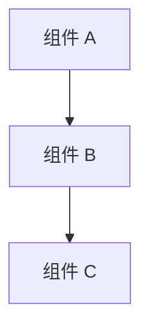
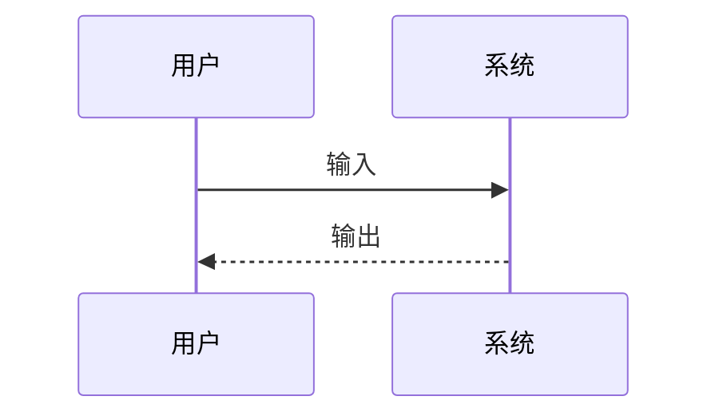
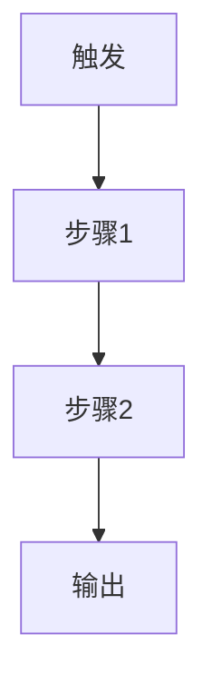
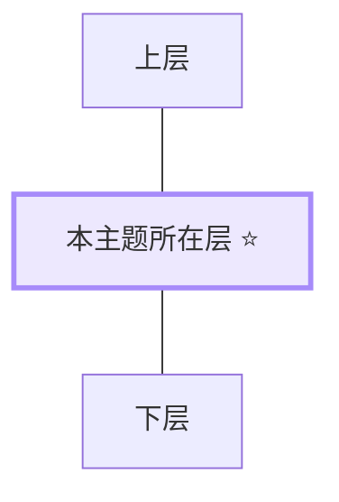

# [主题名] · ATDF Deep Dive
> 日期: YYYY-MM-DD · 深度: Scan/Deep/Handson · 耗时: Xh

## 📖 术语速查

> 正文中出现的英文术语，先扫一遍再往下读。遇到新术语随时追加。

| 术语 | 直译 | 在本主题中的含义 | 生活化比喻 |
|---|---|---|---|
| **Term1** | 直译 | 含义 | 比喻 |
| **Term2** | 直译 | 含义 | 比喻 |

---

## ① 定位
- 一句话:
- 类别:
- 替代了: / 增强了:
- 无它时怎么做:

## ② 架构

### 系统总览



### 数据流



- 核心组件:
- 关键机制:
- 依赖:
- 稳定部分 vs 演化部分:

## ③ 产品
- 用户:
- 分发:
- 定价:
- 上手难度: ⭐x/5

## ④ 业务
- 竞品: 1. 2. 3.
- 护城河:
- 最新动态:
- 5 年生存预测:

## ⑤ 使用
- 最小示例:
    ```python
    # 10 行代码
    ```
- 3 个坑:
- 用 / 不用场景:
- 我的工作接触点:
- 预计学习曲线:

## ⑥ 具体模块拆解（选一个核心模块深入）

> 挑一个最有代表性的模块 / 功能 / API，展示它完整的工作机制。

### 文件结构
```
module/
├── 文件1
├── 文件2
└── 子目录/
```

### 执行流程



### 这个模块教会我们什么

| 设计模式 | 它怎么做 | 我可以怎么用 |
|---|---|---|
| 模式1 | 做法 | 复用方式 |

## ⑦ 生态位 ⭐

### 商业价值分层



- 平台吞噬风险:
- 对我的机会判断:
- 3 年演化预测:
- **值不值得投入**:

## ⑧ 实战迁移（可选，结合自己工作场景）

| 本主题的模式 | 我的项目怎么用 |
|---|---|
| 模式1 | 迁移方式 |

## 🎯 一句话结论（3 个月后再看）

