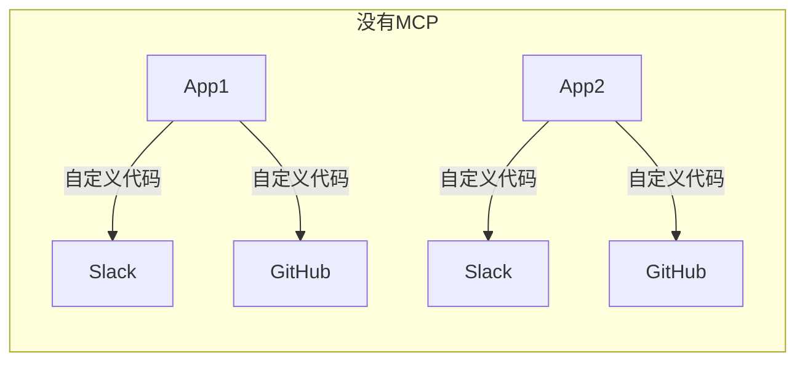
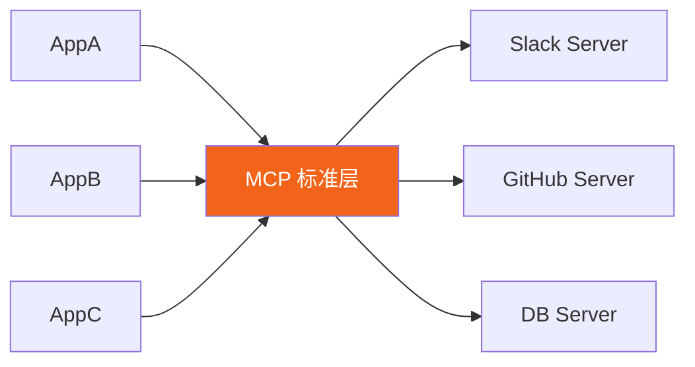
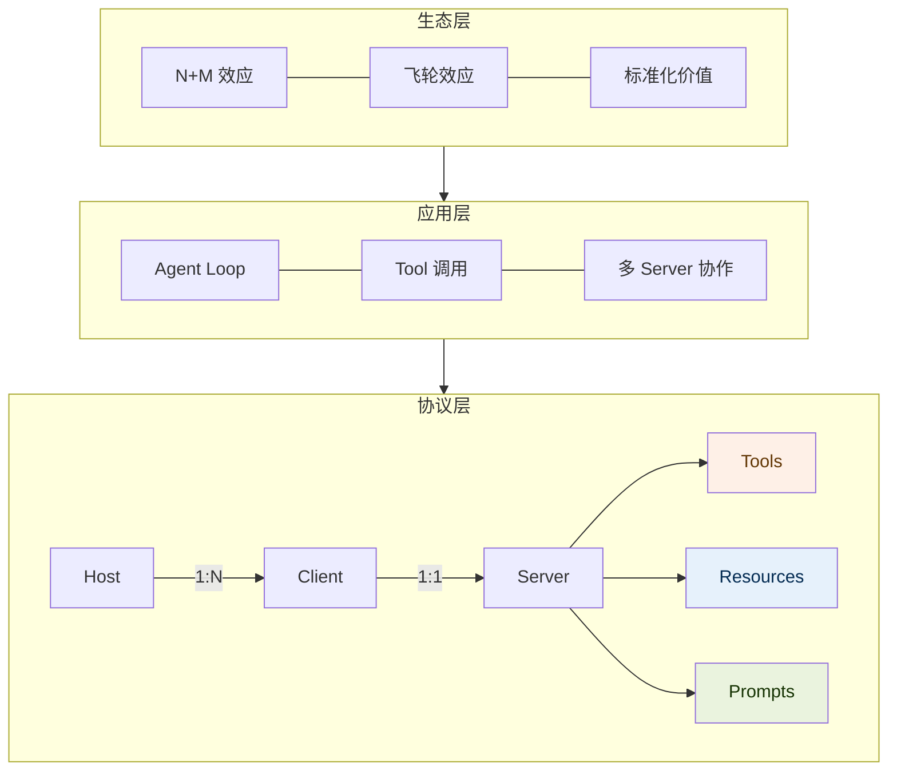

# MCP 基础：是什么、解决什么、为什么重要

## MCP 是什么

**Model Context Protocol（模型上下文协议）**，是 Anthropic 于 2024 年 11 月发布的开放标准，用于规范 AI 模型与外部工具/数据源之间的通信方式。

一句话版本：

> MCP 是给 AI 装插件的标准接口。你写一个 Server，声明"我有哪些工具"，任何支持 MCP 的 AI（Claude/Cursor/Windsurf）都能调用它们——写一次，全局复用。

---

## MCP 解决了什么问题

### 没有 MCP 时：N × M 的碎片化

每个 AI 应用对接每个外部系统，都要各自写一套对接代码，格式不统一，代码无法复用：

10 个 App × 20 个系统 = **200 套不可复用的集成代码**

### 有了 MCP 后：N + M 的标准化

**关键误解澄清**：N+M 不是说"连接数减少"，而是**开发工作量减少**。Server 写好后所有 App 直接复用，每新增一个 App 的边际开发成本变成零。

### N+M 背后的普世思想

引入标准中间层，将乘法复杂度降为加法复杂度——这是人类解决规模化问题的通用模式：

| 领域 | 没有标准层 | 有标准层 |
|---|---|---|
| 经济 | 以物换物 N×N | 货币 N+N |
| 硬件 | 每种外设定制接口 | USB 标准 |
| 网络 | 私有通信协议 | HTTP |
| 数据库 | 私有查询语言 | SQL |
| AI 工具 | 各自写对接代码 | MCP |

---

## MCP 的三层架构

> **命名说明**：不要叫"架构层"，容易和软件架构混淆。**协议层**更精确，聚焦于 MCP 的技术规范本身。

### Host / Client / Server 职责

| 角色 | 是什么 | 例子 |
|---|---|---|
| **Host** | 运行环境，持有 MCP Client | Claude Desktop、Cursor、你开发的 App |
| **Client** | Host 内部创建，**1:1 对应一个 Server** | 每个连接的 Server 对应一个 Client 实例 |
| **Server** | 暴露能力的服务 | GitHub MCP Server、你写的 file-server |

---

## MCP 的三类能力

| 能力 | 谁发起 | 有无副作用 | 本质 |
|---|---|---|---|
| **Tools** | AI 自主决定调用 | 有（执行动作） | 函数调用 |
| **Resources** | AI 按需读取 | 无（只读） | 数据访问 |
| **Prompts** | **用户**主动触发 | 无 | 可复用提示词模板 |

详细说明见 [02-core-concepts/tools-resources-prompts.md](../02-core-concepts/tools-resources-prompts.md)

---

## 生态层：飞轮效应

主流 SaaS（Slack、GitHub、Google Drive）已陆续发布官方 MCP Server；主流 Host（Claude Desktop、Cursor、VS Code）均已支持。就像 USB 出现后外设厂商竞争点从"接口兼容性"转向"功能本身"，MCP 让 AI 应用竞争从"连接哪些系统"转向"用得多好"。

---

## 延伸阅读

- [Tools / Resources / Prompts 三类能力详解](../02-core-concepts/tools-resources-prompts.md)
- [Function Calling 底层机制](../02-core-concepts/function-calling.md)
- [异构系统接入：Adapter & Gateway](../03-practical/adapter-gateway.md)
- [面试题库](../05-interview/qa.md)
