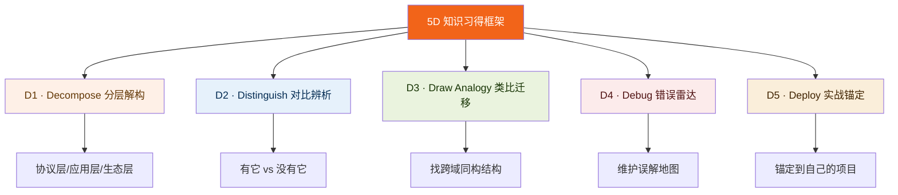

# 知识快速习得方法论 · 5D 框架

从 AI 深度学习对话中抽象的知识拆解框架——结构化、深度化、可视化的完整方法论，**可迁移到任意知识领域**的学习与讲解。

交互版：[5D框架 · 可操作版本](./interactive.html)（下载后浏览器打开）

---

## 核心洞察

> 真正的知识掌握不是"知道答案"，而是能在新场景中**重新推导出**答案。

5D 框架的目的是把知识从"记忆"转化为"思维工具"。

---

## 框架总览



---

## 知识掌握的 5 个深度层次

| 层次 | 特征 | 测试方法 |
|---|---|---|
| **L1 记忆** | 能复述定义 | "MCP 是什么？" |
| **L2 结构** | 能画出层次关系 | "Host/Client/Server 各自的职责？" |
| **L3 迁移** | 能类比到其他领域 | "MCP 和货币有什么共同逻辑？" |
| **L4 批判** | 能指出局限和反对声音 | "MCP 有哪些真实的反对意见？" |
| **L5 创造** | 能在新场景中设计应用 | "给你的项目设计 MCP 架构" |

> **L3（迁移）是判断"真正理解"的分水岭**——能类比才是内化，只能复述还是记忆。

---

## D1 · 分层解构

**任何复杂知识都可以切成 2-4 层，每层解决不同层次的"为什么"。**

分层的本质是把"什么都要讲"变成"在这层只讲这个"，消除认知混乱。

### 三种切割方式

**方式 A：抽象程度切割（最常用）**

```
协议/实现层  →  如何技术实现的
应用/使用层  →  如何在项目中使用
生态/影响层  →  如何影响整个行业
```

MCP 例子：协议层（Host/Client/Server）→ 应用层（Tool调用循环）→ 生态层（N+M效应）

**方式 B：时间维度切割（适合技术演化）**

```
过去怎么做  →  为什么不够好  →  现在怎么做  →  未来方向
```

MCP 例子：Prompt 硬解析 → Function Calling → MCP 标准化

**方式 C：视角维度切割（适合多角色场景）**

```
开发者视角  →  怎么写代码
架构师视角  →  怎么做设计决策
产品/商业视角  →  怎么讲清业务价值
```

---

## D2 · 对比辨析

**概念的边界只能在对比中才能清晰。**"不是什么"和"是什么"同等重要。

### 四种对比结构

| 对比类型 | 适用场景 | MCP 例子 |
|---|---|---|
| **有 vs 没有** | 解释新技术的价值 | N×M vs N+M |
| **A方案 vs B方案** | 架构选型决策 | 静态注册 vs 动态注册 |
| **人理解 vs AI理解** | 解释为何需要重新设计 | REST 路径 vs MCP Tool description |
| **表象 vs 本质** | 纠正直觉性误解 | "AI 调用 Tool" vs "AI 输出意图，代码执行" |

### 颜色语义规则

- 🟢 **绿色框**：推荐做法、正确答案、"有了它"的好处
- 🔴 **红色框**：问题所在、错误做法、"没有它"的痛点
- 🟠 **橙色框**：权衡/中性，既有价值也有弊端的情况

---

## D3 · 类比迁移

**类比不是"比喻"，而是发现两个领域的同构关系——相同的数学/逻辑结构。**

### 发现类比的 3 步法

1. **提炼核心结构**：用最简洁的数学/逻辑语言描述（如："引入中间层消除笛卡尔积"）
2. **跨域搜索同构**：在自然界、经济学、历史、工程学中找相同结构
3. **验证映射完整性**：明确类比的边界，避免过度泛化

### MCP 学习中的类比地图

| MCP 概念 | 类比对象 | 同构的核心结构 | 类比的边界 |
|---|---|---|---|
| MCP 协议 | USB 标准 | 统一接口，即插即用 | USB 是硬件，MCP 是软件协议 |
| N×M → N+M | 货币发明 | 引入中间层消除笛卡尔积 | 货币有价值存储功能，MCP 没有 |
| FC : MCP | HTTP : REST | 原子能力 vs 工程规范 | HTTP/REST 是数据协议，FC/MCP 含 AI 推理 |
| MCP Gateway | API 网关 | 统一入口，内部路由 | API 网关面向开发者，MCP Gateway 面向 AI |

### 类比迁移的威力

理解了"引入标准中间层消除笛卡尔积复杂度"这个结构，你就同时理解了：

货币 / 国际通用语 / 集装箱标准 / USB / HTTP / SQL / MCP

这些领域表面上毫无关系，但解决的是同一个数学问题。学会类比迁移后，学新知识会越来越快——你不是在学新东西，你是在认出熟悉的结构。

---

## D4 · 错误雷达

**误解地图比知识地图更有学习价值。**知道"什么是对的"是 L1；知道"为什么容易理解错"是 L3。

### 三类典型误解模式

**模式 A：词义混淆**

类似词汇导致混淆，初学者把它们当近义词使用。

例："连接数从 200 变成 30"（实际减少的是开发工作量，不是连接数）

**模式 B：局部对整体错**

每个词都理解，但组合起来的逻辑有问题。

例："AI 调用 Tool"——AI 只是输出意图，真正执行的是你的代码

**模式 C：日常语义推断专业含义**

用生活常识去理解技术术语，导致方向性错误。

例："对用户透明"在工程中指"用户感知不到"，和日常的"透明=可见"相反

### 建立误解雷达的操作方法

1. **学习前预测**：把你猜测的答案写下来，学完后看多少是错的
2. **学习中追踪**：每当感到"原来如此"，立刻记下"原来以为什么 → 正确的是什么"
3. **学习后归类**：把误解按上面三种模式分类，找出个人误解倾向
4. **教别人时使用**：先问对方猜答案是什么，再揭示，比直接讲答案记忆更深刻

---

## D5 · 实战锚定

**没有锚定的知识是悬空的。**目标是：当你在真实项目里遇到相关问题，这个知识会自动浮现。

### 四种锚定方式

**① 个人项目锚定（最强）**

每学一个新概念，问自己："如果在 [我的项目] 里用这个，我会怎么设计？"

**② 场景角色锚定**

问自己："作为 [我的角色]，这个知识在什么真实情境下有用？"

ToB 预售例子：学完 N+M 后 → "客户问'我们系统能和 AI 打通吗'，我用 N+M 解释成本降低逻辑"

**③ 面试问答锚定**

为每个重要概念准备一个 30 秒的面试回答。

模板：`[概念] 解决了 [什么问题]，核心机制是 [一句话]，和 [类似概念] 的区别是 [关键差异]`

**④ 代码/流程锚定**

写出 10-20 行伪代码描述这个机制如何工作——执行细节迫使你理解概念的边界。

---

## 向 AI 提问的模板

激发 5D 模式的提问方式。每个模板对应一个深度层次：

### D1 分层解构

```
请从 [协议层/应用层/生态层] 三个维度拆解 [知识点]，每层的核心关注点是什么
[概念A] 和 [概念B] 分别在哪个层次，它们的边界在哪里
```

### D2 对比辨析

```
没有 [概念] 时是什么状态，有了之后具体变化了什么——用具体数字/例子说明
[方案A] 和 [方案B] 的本质区别是什么，各自适合什么场景
```

### D3 类比迁移

```
[概念] 的本质逻辑是什么？在日常生活/历史/其他工程领域有没有相似的结构
把 [概念] 的逻辑上升到更普世的数学/思想层面，可以迁移到哪些其他场景
```

### D4 错误雷达

```
学习 [概念] 时最常见的误解是什么，为什么容易出现这个误解
我的理解是：[你的理解]——这个理解有没有问题，哪里不准确
有哪些反对 [概念/方案] 的真实声音，这些批评有没有道理
```

### D5 实战锚定

```
如果在 [我的具体项目] 里应用 [概念]，架构应该怎么设计
作为 [ToB 预售工程师]，如何向客户用一句话解释 [概念] 的业务价值
面试时被问到 [概念]，30 秒内怎么回答能显示出工程深度而不只是背书
```

### 元提问（最重要）

```
把这次对话中的知识拆解、讲解模式抽象出来，形成可迁移的方法论
```

对 AI 的输出本身追问，是把"一次性学习"转变成"方法论沉淀"的关键操作。**这个文档本身就是这个操作的产物。**

---

## 可视化呈现规则

在做知识笔记、内容创作或对外分享时，用这套规则让知识更易吸收：

| 场景 | 推荐工具 | 原因 |
|---|---|---|
| 层次关系 | Mermaid graph | GitHub 原生渲染，可被搜索索引 |
| 对比决策 | 绿框/红框 | 颜色传达价值判断，不用读完就能感知 |
| 流程循环 | Mermaid sequence | 比 ASCII 图清晰，带箭头和角色标注 |
| 代码示例 | 代码块 + 中文注释 | 中文注释给读者，代码是示例 |
| 多维度比较 | 表格 | 只在有 2 个以上维度需要对比时才用 |

---

*方法论版本 v1.0 · 从 MCP 学习对话中提炼 · 持续迭代*
